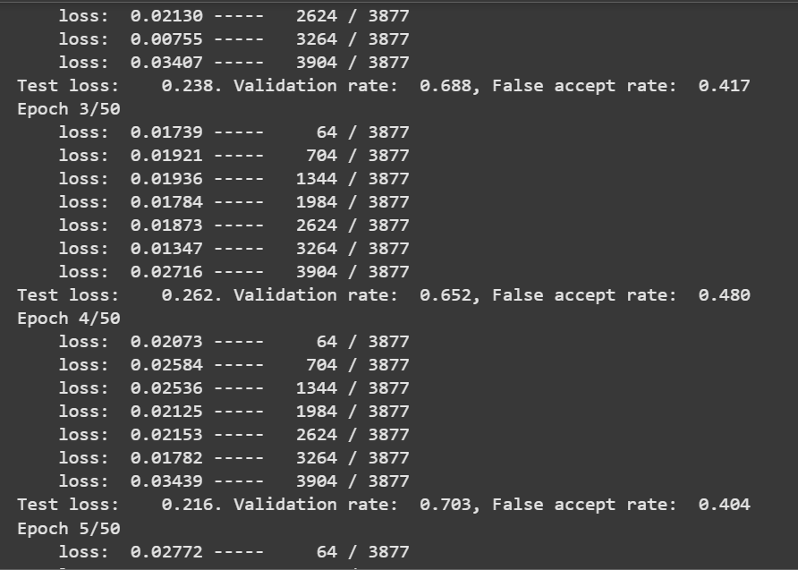

# Issue1: Loss not converging (2025_04_05)
    Description: The loss constantly stays at 0.2, which is the margin between positive and negative set. It means the model is not learning meaningful difference. It may be caused by data not being normalized before feeding into the model. Without normalizing the input data, it may be hard for the model to learn the difference between positive and negative input.

    Possible Solution:
        1. Normalize the input.
        2. Feed semi-negative samples to accelerate training.
        3. Acquire a bigger dataset (Currently have 4307 samples in the dataset).

## Update (2025_04_10)
    I tried normalizing the input and implementing semi-hard negative triplet loss. Nevertheless, both attempts fail to solve the non-converging issue. Yet, after importing facenet resnet model from https://github.com/timesler/facenet-pytorch.git, I found out that the loss is converging. True accept rate is increasing and false accept rate is also decreasinng in test loop.

    The issue will most likely be related to model architecture. My current model architecture is built on inception block. Inception block has the advantage of combining features from CNN block from different kernel sizes. However, there is a possibility that deeper training does not help the model learning the features. A resnet block can go around this potential issue by adding the input to the output of an inception block, allowing model to "not learn" anything.