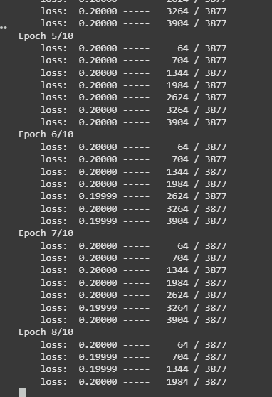

# Issue1: Loss not converging (2025_04_05)
    Description: The loss constantly stays at 0.2, which is the margin between positive and negative set. It means the model is not learning meaningful difference. It may be caused by data not being normalized before feeding into the model. Without normalizing the input data, it may be hard for the model to learn the difference between positive and negative input.

    Possible Solution:
        1. Normalize the input.
        2. Feed semi-negative samples to accelerate training.
        3. Acquire a bigger dataset (Currently have 4307 samples in the dataset).

